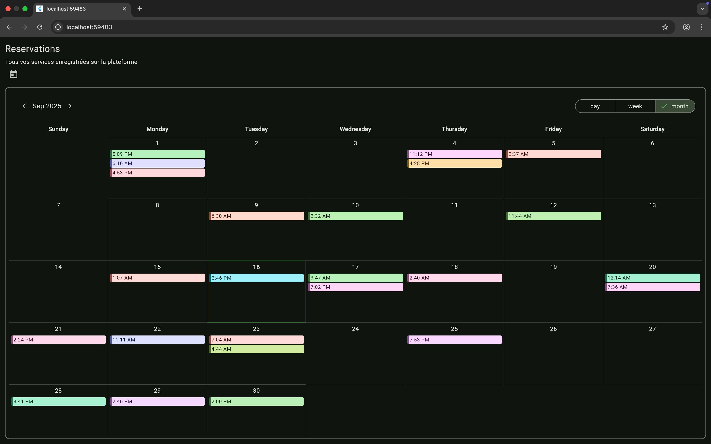
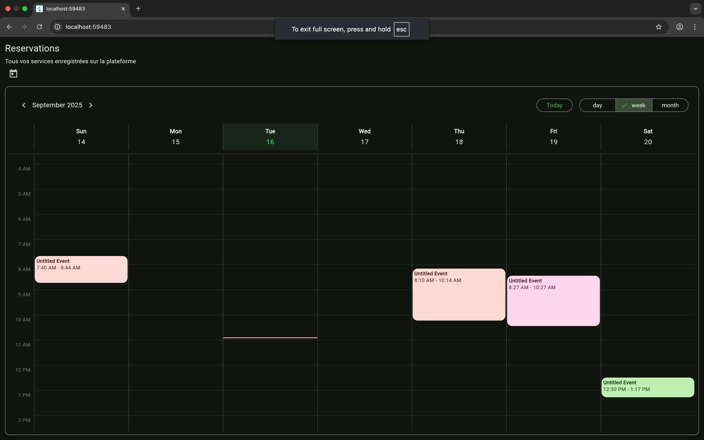
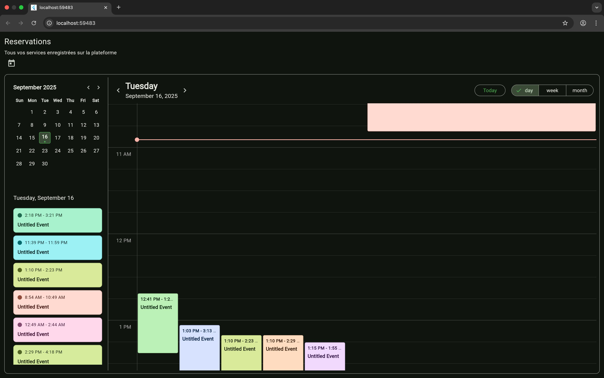
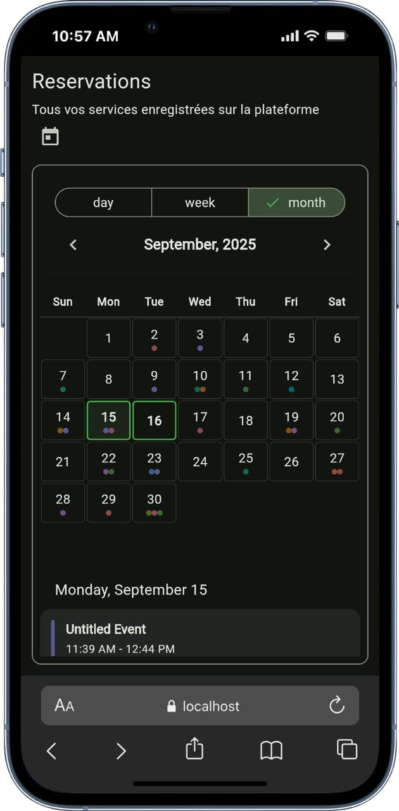
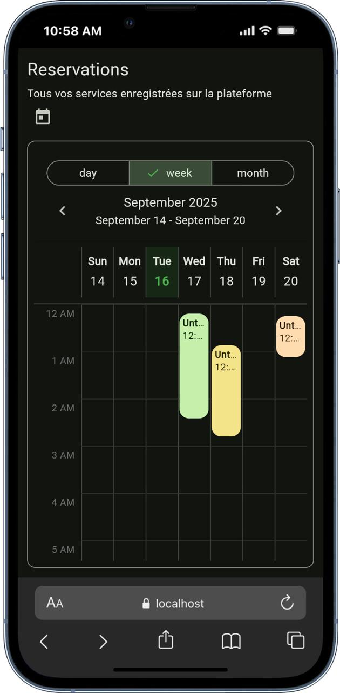
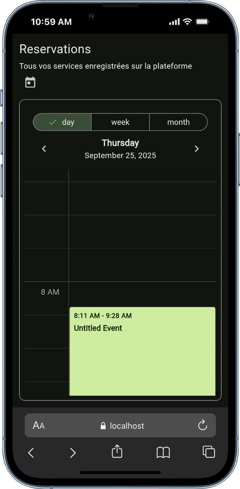
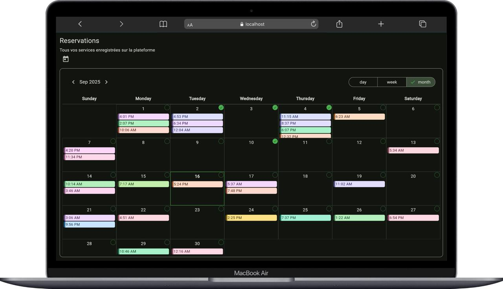
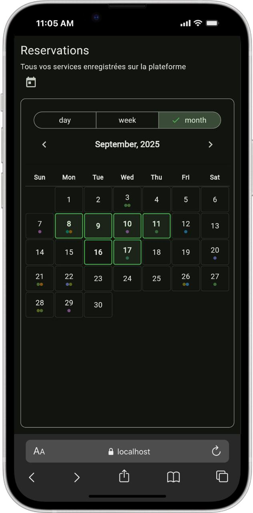

# Timely X Flutter

[](https://pub.dev/packages/timely_x)
[](https://opensource.org/licenses/MIT)
[](https://github.com/loicgeek/timely_x_flutter/pulls)
[](https://flutter.dev)

A powerful and customizable calendar and resource scheduling library for Flutter applications. Timely X provides beautiful, responsive calendar views and resource scheduling components to help you build professional scheduling applications with ease.

## 📱 Screenshots

| Month View | Week View | Day View |
|------------|-----------|----------|
|  |  |  |

*Beautiful, responsive calendar views that adapt to your app's theme*

| Month View Small | Week View Small | Day View Small |
|------------|-----------|----------|
|  |  |  |

*Selection mode*

| Large Screen | Small screen |
|------------|-----------|
|  |  |

## ✨ Features

### Core Functionality
- **Multiple View Modes**: Switch between Day, Week, and Month views seamlessly
- **Resource Scheduling**: Manage resources like rooms, employees, equipment, or any bookable item
- **Event Management**: Create, display, and interact with time-based events
- **Multi-Selection**: Select multiple dates in month view for bulk operations

### User Experience
- **Responsive Design**: Works perfectly on mobile, tablet, and desktop
- **Interactive**: Support for tap, long-press, and right-click interactions
- **Smooth Navigation**: Intuitive date navigation with customizable controls
- **Context Menus**: Right-click support for desktop applications

### Customization
- **Fully Customizable**: Customize colors, layouts, fonts, and behaviors
- **Theme Integration**: Seamlessly integrates with Material Design 3
- **Custom Builders**: Override default widgets with your custom implementations
- **Localization Ready**: Built-in support for multiple languages

### Developer Experience
- **TypeScript-like Generics**: Type-safe event handling with custom event models
- **Extensive Callbacks**: Rich event system for handling user interactions
- **Performance Optimized**: Efficient rendering and memory usage
- **Well Documented**: Comprehensive documentation with examples

## 🚀 Installation

Add the following to your `pubspec.yaml` file:

```yaml
dependencies:
  timely_x: ^0.0.1  # Check for the latest version on pub.dev
  intl: ^0.18.0     # For internationalization and date formatting
  jiffy: ^6.2.0     # For advanced date manipulation
```

Then run:

```bash
flutter pub get
```

## 🎯 Quick Start

### Basic Month Calendar

```dart
import 'package:flutter/material.dart';
import 'package:timely_x/timely_x.dart';

class BasicCalendarExample extends StatefulWidget {
  @override
  _BasicCalendarExampleState createState() => _BasicCalendarExampleState();
}

class _BasicCalendarExampleState extends State<BasicCalendarExample> {
  List<TyxEvent> events = [];
  DateTime selectedDate = DateTime.now();

  @override
  void initState() {
    super.initState();
    _loadSampleEvents();
  }

  void _loadSampleEvents() {
    events = [
      TyxEvent(
        id: '1',
        title: 'Team Meeting',
        start: DateTime.now().add(Duration(hours: 10)),
        end: DateTime.now().add(Duration(hours: 11)),
        color: Colors.blue,
        description: 'Weekly team sync meeting',
      ),
      TyxEvent(
        id: '2',
        title: 'Client Presentation',
        start: DateTime.now().add(Duration(days: 1, hours: 14)),
        end: DateTime.now().add(Duration(days: 1, hours: 15, minutes: 30)),
        color: Colors.orange,
        description: 'Present project progress to client',
      ),
      // Add more events as needed
    ];
  }

  @override
  Widget build(BuildContext context) {
    return Scaffold(
      appBar: AppBar(
        title: Text('Timely X Calendar'),
        actions: [
          IconButton(
            icon: Icon(Icons.today),
            onPressed: () {
              setState(() {
                selectedDate = DateTime.now();
              });
            },
          ),
        ],
      ),
      body: TyxCalendarView<TyxEvent>(
        option: TyxCalendarOption<TyxEvent>(
          initialView: TyxView.month,
          initialDate: selectedDate,
          showTrailingDays: true,
          startWeekDay: 1, // Start week on Monday
        ),
        events: events,
        onDateChanged: (date, events) {
          setState(() {
            selectedDate = date;
          });
          print('Selected: $date with ${events.length} events');
        },
        onEventTapped: (event) {
          _showEventDetails(event);
        },
        onViewChanged: (view) {
          print('View changed to: $view');
        },
      ),
      floatingActionButton: FloatingActionButton(
        onPressed: _addNewEvent,
        child: Icon(Icons.add),
        tooltip: 'Add Event',
      ),
    );
  }

  void _showEventDetails(TyxEvent event) {
    showDialog(
      context: context,
      builder: (context) => AlertDialog(
        title: Text(event.title ?? 'Event'),
        content: Column(
          mainAxisSize: MainAxisSize.min,
          crossAxisAlignment: CrossAxisAlignment.start,
          children: [
            Text('Start: ${event.start}'),
            Text('End: ${event.end}'),
            if (event.description != null)
              Padding(
                padding: EdgeInsets.only(top: 8),
                child: Text(event.description!),
              ),
          ],
        ),
        actions: [
          TextButton(
            onPressed: () => Navigator.pop(context),
            child: Text('Close'),
          ),
        ],
      ),
    );
  }

  void _addNewEvent() {
    // Implement add event functionality
    setState(() {
      events.add(TyxEvent(
        id: DateTime.now().millisecondsSinceEpoch.toString(),
        title: 'New Event',
        start: selectedDate.add(Duration(hours: 9)),
        end: selectedDate.add(Duration(hours: 10)),
        color: Colors.green,
      ));
    });
  }
}
```

## 🛠️ Advanced Usage

### Resource Scheduling View

Perfect for booking systems, room scheduling, or equipment management:

```dart
class ResourceSchedulingExample extends StatefulWidget {
  @override
  _ResourceSchedulingExampleState createState() => _ResourceSchedulingExampleState();
}

class _ResourceSchedulingExampleState extends State<ResourceSchedulingExample> {
  List<TyxResource> resources = [];
  List<TyxEvent> events = [];
  DateTime currentDate = DateTime.now();

  @override
  void initState() {
    super.initState();
    _initializeResources();
    _loadEvents();
  }

  void _initializeResources() {
    resources = [
      TyxResource(id: 'room_a', name: 'Conference Room A'),
      TyxResource(id: 'room_b', name: 'Conference Room B'),
      TyxResource(id: 'room_c', name: 'Meeting Room C'),
      TyxResource(id: 'equipment_1', name: 'Projector #1'),
    ];
  }

  void _loadEvents() {
    events = generateEventsForDay(resources, currentDate);
  }

  @override
  Widget build(BuildContext context) {
    return Scaffold(
      appBar: AppBar(
        title: Text('Resource Scheduling'),
        actions: [
          IconButton(
            icon: Icon(Icons.refresh),
            onPressed: () {
              setState(() {
                _loadEvents();
              });
            },
          ),
        ],
      ),
      body: TyxResourceView(
        option: TyxResourceOption(
          resources: resources,
          events: events,
          initialDate: currentDate,
          timeslotHeight: 60.0,
          timelotSlotDuration: Duration(minutes: 30),
          timeslotStartTime: TimeOfDay(hour: 8, minute: 0),
          cellWidth: 200.0,
          timesCellWidth: 80.0,
          resourceHeaderHeight: 80.0,
          // Custom resource header builder
          resourceBuilder: (context, resourceEnhanced) {
            final resource = resourceEnhanced.resource!;
            return Container(
              decoration: BoxDecoration(
                gradient: LinearGradient(
                  colors: [
                    Theme.of(context).primaryColor.withOpacity(0.1),
                    Theme.of(context).primaryColor.withOpacity(0.2),
                  ],
                  begin: Alignment.topCenter,
                  end: Alignment.bottomCenter,
                ),
                border: Border(
                  left: BorderSide(color: Colors.grey.shade300),
                ),
                borderRadius: BorderRadius.vertical(top: Radius.circular(8)),
              ),
              child: Column(
                mainAxisAlignment: MainAxisAlignment.center,
                children: [
                  Icon(
                    resource.name.contains('Room') 
                        ? Icons.meeting_room 
                        : Icons.devices,
                    color: Theme.of(context).primaryColor,
                    size: 24,
                  ),
                  SizedBox(height: 8),
                  Text(
                    resource.name,
                    style: Theme.of(context).textTheme.titleSmall?.copyWith(
                      fontWeight: FontWeight.bold,
                    ),
                    textAlign: TextAlign.center,
                    maxLines: 2,
                    overflow: TextOverflow.ellipsis,
                  ),
                ],
              ),
            );
          },
          // Custom event builder
          eventBuilder: (context, eventEnhanced) {
            final event = eventEnhanced.e;
            return Container(
              margin: EdgeInsets.all(2),
              decoration: BoxDecoration(
                color: event.color,
                borderRadius: BorderRadius.circular(8),
                boxShadow: [
                  BoxShadow(
                    color: Colors.black.withOpacity(0.1),
                    blurRadius: 2,
                    offset: Offset(0, 1),
                  ),
                ],
              ),
              child: Padding(
                padding: EdgeInsets.all(8),
                child: Column(
                  crossAxisAlignment: CrossAxisAlignment.start,
                  children: [
                    Text(
                      event.title ?? 'Booking',
                      style: TextStyle(
                        color: Colors.white,
                        fontWeight: FontWeight.bold,
                        fontSize: 12,
                      ),
                      maxLines: 1,
                      overflow: TextOverflow.ellipsis,
                    ),
                    SizedBox(height: 2),
                    Text(
                      '${TimeOfDay.fromDateTime(event.start).format(context)} - ${TimeOfDay.fromDateTime(event.end).format(context)}',
                      style: TextStyle(
                        color: Colors.white.withOpacity(0.9),
                        fontSize: 10,
                      ),
                    ),
                  ],
                ),
              ),
            );
          },
        ),
        onDateChanged: (date) {
          setState(() {
            currentDate = date;
            _loadEvents();
          });
        },
      ),
    );
  }
}
```

### Multi-Selection Calendar

Ideal for date range pickers or bulk operations:

```dart
class MultiSelectionExample extends StatefulWidget {
  @override
  _MultiSelectionExampleState createState() => _MultiSelectionExampleState();
}

class _MultiSelectionExampleState extends State<MultiSelectionExample> {
  Set<DateTime> selectedDates = {};

  @override
  Widget build(BuildContext context) {
    return Scaffold(
      appBar: AppBar(
        title: Text('Multi-Selection Calendar'),
        subtitle: Text('${selectedDates.length} dates selected'),
        actions: [
          IconButton(
            icon: Icon(Icons.clear),
            onPressed: () {
              setState(() {
                selectedDates.clear();
              });
            },
            tooltip: 'Clear Selection',
          ),
        ],
      ),
      body: Column(
        children: [
          if (selectedDates.isNotEmpty)
            Container(
              padding: EdgeInsets.all(16),
              child: Wrap(
                spacing: 8,
                runSpacing: 8,
                children: selectedDates.map((date) {
                  return Chip(
                    label: Text(
                      '${date.day}/${date.month}',
                      style: TextStyle(fontSize: 12),
                    ),
                    onDeleted: () {
                      setState(() {
                        selectedDates.remove(date);
                      });
                    },
                    deleteIconColor: Colors.red,
                  );
                }).toList(),
              ),
            ),
          Expanded(
            child: TyxCalendarView<TyxEvent>(
              option: TyxCalendarOption<TyxEvent>(
                initialView: TyxView.month,
                initialDate: DateTime.now(),
                showTrailingDays: false,
              ),
              mode: TyxCalendarMode.multiSelection,
              selectedDates: selectedDates,
              onSelectedDatesChanged: (dates) {
                setState(() {
                  selectedDates = dates;
                });
              },
              events: [],
            ),
          ),
        ],
      ),
    );
  }
}
```

### Custom Event Widget

Create beautiful, branded event indicators:

```dart
Widget customEventBuilder(BuildContext context, TyxEvent event) {
  return Container(
    margin: EdgeInsets.only(bottom: 2),
    child: Row(
      children: [
        // Color indicator
        Container(
          width: 4,
          height: 20,
          decoration: BoxDecoration(
            color: event.color,
            borderRadius: BorderRadius.circular(2),
          ),
        ),
        SizedBox(width: 6),
        // Event content
        Expanded(
          child: Container(
            padding: EdgeInsets.symmetric(horizontal: 6, vertical: 4),
            decoration: BoxDecoration(
              color: event.color.withOpacity(0.1),
              borderRadius: BorderRadius.circular(4),
              border: Border.all(
                color: event.color.withOpacity(0.3),
                width: 1,
              ),
            ),
            child: Row(
              children: [
                // Time
                Text(
                  TimeOfDay.fromDateTime(event.start).format(context),
                  style: TextStyle(
                    color: event.color,
                    fontSize: 10,
                    fontWeight: FontWeight.w600,
                  ),
                ),
                SizedBox(width: 6),
                // Title
                Expanded(
                  child: Text(
                    event.title ?? 'Untitled',
                    style: TextStyle(
                      color: Colors.black87,
                      fontSize: 11,
                      fontWeight: FontWeight.w500,
                    ),
                    maxLines: 1,
                    overflow: TextOverflow.ellipsis,
                  ),
                ),
                // Priority indicator
                if (event.description?.contains('urgent') == true)
                  Container(
                    width: 6,
                    height: 6,
                    decoration: BoxDecoration(
                      color: Colors.red,
                      shape: BoxShape.circle,
                    ),
                  ),
              ],
            ),
          ),
        ),
      ],
    ),
  );
}

// Usage in calendar option
TyxCalendarOption<TyxEvent>(
  monthOption: TyxCalendarMonthOption<TyxEvent>(
    eventIndicatorBuilder: customEventBuilder,
    maxIndicatorsPerDay: 5,
  ),
)
```

## 🎨 Theming & Customization

### Using TyxCalendarCustomizer

```dart
TyxCalendarView(
  customizer: TyxCalendarCustomizer(
    // Header styling
    headerStyle: TyxHeaderStyle(
      backgroundColor: Colors.blue.shade50,
      titleStyle: TextStyle(
        fontSize: 24,
        fontWeight: FontWeight.bold,
        color: Colors.blue.shade800,
      ),
      todayButtonStyle: ElevatedButton.styleFrom(
        backgroundColor: Colors.blue,
        foregroundColor: Colors.white,
        shape: RoundedRectangleBorder(
          borderRadius: BorderRadius.circular(20),
        ),
      ),
      padding: EdgeInsets.all(20),
    ),
    
    // Day cell styling
    dayCellStyle: TyxDayCellStyle(
      todayBackgroundColor: Colors.blue.shade100,
      todayTextStyle: TextStyle(
        color: Colors.blue.shade800,
        fontWeight: FontWeight.bold,
      ),
      selectedDecoration: BoxDecoration(
        color: Colors.blue.shade200,
        borderRadius: BorderRadius.circular(12),
        border: Border.all(color: Colors.blue.shade600, width: 2),
      ),
      useCircularIndicator: true,
      borderRadius: BorderRadius.circular(8),
    ),
    
    // Event styling
    eventStyle: TyxEventStyle(
      borderRadius: BorderRadius.circular(10),
      showEventTime: true,
      useEventColorAsBackground: true,
      backgroundOpacity: 0.8,
      padding: EdgeInsets.symmetric(horizontal: 8, vertical: 4),
      textStyle: TextStyle(
        fontWeight: FontWeight.w500,
        fontSize: 11,
      ),
    ),
    
    // Weekday header styling
    weekdayStyle: TyxWeekdayStyle(
      textStyle: TextStyle(
        fontWeight: FontWeight.w600,
        fontSize: 14,
        color: Colors.grey.shade600,
      ),
      padding: EdgeInsets.symmetric(vertical: 12),
      useAbbreviatedNames: true,
      uppercase: true,
    ),
    
    // Custom formatters
    dateHeaderFormatter: (date) {
      return DateFormat('MMMM yyyy', 'en_US').format(date);
    },
    
    // Behavior settings
    maxEventsPerDay: 4,
    showTodayButton: true,
    showViewSelector: true,
    animateViewChanges: true,
    viewChangeAnimationDuration: Duration(milliseconds: 400),
  ),
  // ... other properties
)
```

### Dark Theme Support

```dart
class ThemeAwareCalendar extends StatelessWidget {
  @override
  Widget build(BuildContext context) {
    final isDark = Theme.of(context).brightness == Brightness.dark;
    
    return TyxCalendarView(
      customizer: TyxCalendarCustomizer(
        dayCellStyle: TyxDayCellStyle(
          backgroundColor: isDark ? Colors.grey.shade800 : Colors.white,
          textStyle: TextStyle(
            color: isDark ? Colors.white : Colors.black,
          ),
          todayBackgroundColor: isDark 
              ? Colors.blue.shade700 
              : Colors.blue.shade100,
          borderColor: isDark 
              ? Colors.grey.shade600 
              : Colors.grey.shade300,
        ),
        headerStyle: TyxHeaderStyle(
          backgroundColor: isDark 
              ? Colors.grey.shade900 
              : Colors.grey.shade50,
          titleStyle: TextStyle(
            color: isDark ? Colors.white : Colors.black,
          ),
        ),
      ),
      // ... other properties
    );
  }
}
```

## 🌐 Localization

TimelyX supports internationalization out of the box. Make sure to configure your app properly:

### 1. Add Localizations to Your App

```dart
import 'package:flutter_localizations/flutter_localizations.dart';

MaterialApp(
  localizationsDelegates: [
    GlobalMaterialLocalizations.delegate,
    GlobalWidgetsLocalizations.delegate,
    GlobalCupertinoLocalizations.delegate,
  ],
  supportedLocales: [
    const Locale('en', ''), // English
    const Locale('fr', ''), // French
    const Locale('es', ''), // Spanish
    const Locale('de', ''), // German
    const Locale('it', ''), // Italian
    const Locale('pt', ''), // Portuguese
    const Locale('ru', ''), // Russian
    const Locale('ja', ''), // Japanese
    const Locale('zh', ''), // Chinese
    const Locale('ar', ''), // Arabic
  ],
  // ... rest of your app
)
```

### 2. Custom Date Formatting

```dart
TyxCalendarOption(
  // Custom date formatter respecting locale
  dateHeaderFormatter: (date) {
    return DateFormat.yMMMM(Localizations.localeOf(context).languageCode)
        .format(date);
  },
)
```

### 3. Right-to-Left (RTL) Support

TimelyX automatically adapts to RTL languages when properly configured:

```dart
MaterialApp(
  // Enable RTL support
  localizationsDelegates: [
    GlobalMaterialLocalizations.delegate,
    GlobalWidgetsLocalizations.delegate,
    GlobalCupertinoLocalizations.delegate,
  ],
  supportedLocales: [
    const Locale('ar', ''), // Arabic
    const Locale('he', ''), // Hebrew
    const Locale('fa', ''), // Persian
  ],
)
```

## 📊 Performance Optimization

### Efficient Event Loading

For applications with large datasets, implement efficient event loading:

```dart
class EfficientCalendarExample extends StatefulWidget {
  @override
  _EfficientCalendarExampleState createState() => _EfficientCalendarExampleState();
}

class _EfficientCalendarExampleState extends State<EfficientCalendarExample> {
  Map<String, List<TyxEvent>> _eventCache = {};
  bool _isLoading = false;

  Future<List<TyxEvent>> _loadEvents(TyxCalendarBorder border) async {
    final cacheKey = '${border.start?.millisecondsSinceEpoch}-${border.end?.millisecondsSinceEpoch}';
    
    // Return cached events if available
    if (_eventCache.containsKey(cacheKey)) {
      return _eventCache[cacheKey]!;
    }

    setState(() {
      _isLoading = true;
    });

    try {
      // Simulate API call
      await Future.delayed(Duration(milliseconds: 500));
      
      // Load events from API/database
      final events = await EventService.getEvents(
        start: border.start!,
        end: border.end!,
      );
      
      // Cache the results
      _eventCache[cacheKey] = events;
      
      return events;
    } finally {
      setState(() {
        _isLoading = false;
      });
    }
  }

  @override
  Widget build(BuildContext context) {
    return Scaffold(
      body: Stack(
        children: [
          TyxCalendarView<TyxEvent>(
            getEvents: _loadEvents,
            option: TyxCalendarOption<TyxEvent>(
              initialView: TyxView.month,
              initialDate: DateTime.now(),
            ),
            onBorderChanged: (border) {
              // Prefetch adjacent months
              _prefetchAdjacentMonths(border);
            },
          ),
          if (_isLoading)
            Center(
              child: CircularProgressIndicator(),
            ),
        ],
      ),
    );
  }

  void _prefetchAdjacentMonths(TyxCalendarBorder border) {
    // Prefetch previous month
    final prevMonth = TyxCalendarBorder(
      start: DateTime(border.start!.year, border.start!.month - 1, 1),
      end: DateTime(border.start!.year, border.start!.month, 0),
    );
    
    // Prefetch next month
    final nextMonth = TyxCalendarBorder(
      start: DateTime(border.end!.year, border.end!.month + 1, 1),
      end: DateTime(border.end!.year, border.end!.month + 2, 0),
    );
    
    // Load in background
    Future.microtask(() {
      _loadEvents(prevMonth);
      _loadEvents(nextMonth);
    });
  }
}
```

### Memory Management

```dart
class MemoryEfficientCalendar extends StatefulWidget {
  @override
  _MemoryEfficientCalendarState createState() => _MemoryEfficientCalendarState();
}

class _MemoryEfficientCalendarState extends State<MemoryEfficientCalendar>
    with AutomaticKeepAliveClientMixin {
  
  @override
  bool get wantKeepAlive => false; // Don't keep alive when not visible

  @override
  void dispose() {
    // Clean up resources
    _eventCache.clear();
    super.dispose();
  }

  // Implementation...
}
```

## 📚 API Reference

### Core Classes

#### TyxCalendarView<T extends TyxEvent>

The main calendar widget supporting multiple view types.

| Property | Type | Default | Description |
|----------|------|---------|-------------|
| `option` | `TyxCalendarOption<T>` | required | Configuration options |
| `events` | `List<T>?` | `null` | Static list of events |
| `getEvents` | `Future<List<T>> Function(TyxCalendarBorder)?` | `null` | Dynamic event loader |
| `mode` | `TyxCalendarMode` | `normal` | Selection mode |
| `selectedDates` | `Set<DateTime>?` | `null` | Pre-selected dates |
| `customizer` | `TyxCalendarCustomizer?` | `null` | Visual customization |

**Callbacks:**

| Callback | Signature | Description |
|----------|-----------|-------------|
| `onDateChanged` | `Function(DateTime, List<T>)?` | Date selection changed |
| `onViewChanged` | `Function(TyxView)?` | View type changed |
| `onEventTapped` | `Function(T)?` | Event tapped |
| `onRightClick` | `OnRightClick?` | Right-click/long-press |
| `onBorderChanged` | `Function(TyxCalendarBorder)?` | Visible date range changed |
| `onSelectedDatesChanged` | `Function(Set<DateTime>)?` | Multi-selection changed |

#### TyxResourceView

Specialized view for resource scheduling.

| Property | Type | Default | Description |
|----------|------|---------|-------------|
| `option` | `TyxResourceOption` | required | Resource-specific options |
| `onDateChanged` | `Function(DateTime)?` | `null` | Date navigation |
| `onShowDatePicker` | `Future<DateTime?> Function({required BuildContext})?` | `null` | Custom date picker |
| `currentDateFormatter` | `String Function(DateTime)?` | `null` | Date display format |

#### TyxDatepicker

Standalone date picker component.

| Property | Type | Default | Description |
|----------|------|---------|-------------|
| `option` | `TyxCalendarOption` | required | Basic calendar options |
| `view` | `TyxView` | required | Display view type |
| `initialDate` | `DateTime?` | `null` | Initial selected date |
| `onDateSelected` | `Function(DateTime)?` | `null` | Date selection callback |

### Configuration Classes

#### TyxCalendarOption<T extends TyxEvent>

Main configuration class for calendar behavior and appearance.

**Time Configuration:**
- `timeslotHeight: double?` - Height of time slots (default: 30.0)
- `timelotSlotDuration: Duration?` - Duration per slot (default: 15 minutes)
- `timeslotStartTime: TimeOfDay?` - Start time (default: 00:00)
- `timeslotEndTime: TimeOfDay?` - End time (default: 23:59)

**Layout Configuration:**
- `cellWidth: double?` - Width of resource columns (default: 120.0)
- `timesCellWidth: double?` - Width of time column (default: 60.0)
- `resourceHeaderHeight: double?` - Height of resource headers (default: 40.0)

**View Configuration:**
- `initialView: TyxView` - Starting view (default: month)
- `initialDate: DateTime?` - Initial date (default: now)
- `showTrailingDays: bool` - Show adjacent month days (default: false)
- `startWeekDay: int?` - First day of week (1=Monday, 7=Sunday)

**Data Configuration:**
- `resources: List<TyxResource>?` - Available resources
- `monthOption: TyxCalendarMonthOption<T>?` - Month-specific settings
- `weekOption: TyxCalendarWeekOption<T>?` - Week-specific settings
- `dayOption: TyxCalendarDayOption<T>?` - Day-specific settings

**Custom Builders:**
- `resourceBuilder: Widget Function(BuildContext, TyxResourceEnhanced)?` - Custom resource widgets

### Event Models

#### TyxEvent

Base event class with essential properties.

```dart
class TyxEvent {
  DateTime start;           // Event start time
  DateTime end;            // Event end time  
  Color color;             // Event color
  String? resourceId;      // Associated resource ID
  String? id;              // Unique identifier
  String? title;           // Event title
  String? description;     // Event description
  String? locationAddress; // Location information
}
```

#### TyxEventEnhanced<T>

Enhanced event with layout information (used in custom builders).

```dart
class TyxEventEnhanced<T> {
  T e;                    // Original event
  double position;        // Y position in view
  double height;          // Rendered height
  double width;           // Rendered width
  double offsetX;         // X offset for overlapping
  int groupSize;          // Number of overlapping events
}
```

### Resource Models

#### TyxResource

Represents a bookable resource.

```dart
class TyxResource {
  String id;    // Unique identifier
  String name;  // Display name
}
```

#### TyxResourceEnhanced

Enhanced resource with layout information.

```dart
class TyxResourceEnhanced {
  double width;            // Rendered width
  double height;           // Rendered height
  TyxResource? resource;   // Original resource
}
```

### Enums

```dart
enum TyxView { day, week, month }
enum TyxCalendarMode { normal, multiSelection }
```

### Helper Functions

```dart
// Generate sample resources
List<TyxResource> generateResources(int count);

// Generate sample events for a day
List<TyxEvent> generateEventsForDay(List<TyxResource> resources, DateTime day);

// Generate sample events for a month  
List<TyxEvent> generateEventsForMonth(List<TyxResource> resources, DateTime day);

// Date utilities
bool isSameDay(DateTime a, DateTime b);
bool isTodayMethod(DateTime date);
```

## 🔧 Troubleshooting

### Common Issues

#### Events Not Displaying

**Problem**: Events are not showing up in the calendar.

**Solutions**:
1. Ensure event dates are within the visible date range
2. Check that `events` property or `getEvents` callback is properly set
3. Verify event colors are not transparent
4. Check if custom `eventIndicatorBuilder` is rendering correctly

```dart
// Debug event loading
TyxCalendarView(
  events: events,
  onBorderChanged: (border) {
    print('Loading events from ${border.start} to ${border.end}');
    print('Found ${events.length} events');
  },
)
```

#### Performance Issues

**Problem**: Calendar is slow or laggy.

**Solutions**:
1. Implement `getEvents` for dynamic loading instead of large static lists
2. Use event caching to avoid redundant API calls
3. Limit the number of events displayed per day
4. Optimize custom builders to avoid expensive operations

```dart
// Efficient event loading
TyxCalendarView(
  getEvents: (border) async {
    // Only load events for visible period
    return await EventService.getEventsInRange(
      start: border.start!,
      end: border.end!,
      limit: 1000, // Reasonable limit
    );
  },
)
```

#### Layout Issues

**Problem**: Calendar doesn't fit properly on screen.

**Solutions**:
1. Wrap calendar in `Expanded` widget within a `Column`
2. Set appropriate `timeslotHeight` and `cellWidth` for your screen size
3. Use `SingleChildScrollView` for horizontal scrolling in resource view
4. Test on different screen sizes and orientations

```dart
// Proper layout structure
Column(
  children: [
    AppBar(title: Text('Calendar')),
    Expanded(  // Important: allows calendar to fill remaining space
      child: TyxCalendarView(
        option: TyxCalendarOption(
          timeslotHeight: 50.0,  // Adjust for your needs
          cellWidth: MediaQuery.of(context).size.width / 4, // Responsive
        ),
      ),
    ),
  ],
)
```

#### Theme Issues

**Problem**: Calendar doesn't match app theme.

**Solutions**:
1. Use `TyxCalendarCustomizer` to align with your design system
2. Access theme colors via `Theme.of(context)`
3. Test in both light and dark modes
4. Ensure proper contrast ratios for accessibility

```dart
// Theme-aware calendar
Widget build(BuildContext context) {
  final theme = Theme.of(context);
  
  return TyxCalendarView(
    customizer: TyxCalendarCustomizer(
      dayCellStyle: TyxDayCellStyle(
        todayBackgroundColor: theme.primaryColor.withOpacity(0.1),
        selectedDecoration: BoxDecoration(
          color: theme.primaryColor,
          borderRadius: BorderRadius.circular(8),
        ),
      ),
    ),
  );
}
```

### Debug Mode

Enable debug prints for troubleshooting:

```dart
// Add to main()
if (kDebugMode) {
  debugPrint('TimelyX Debug Mode Enabled');
}

// Use in calendar callbacks
TyxCalendarView(
  onBorderChanged: (border) {
    if (kDebugMode) {
      debugPrint('Border changed: ${border.start} - ${border.end}');
    }
  },
  onEventTapped: (event) {
    if (kDebugMode) {
      debugPrint('Event tapped: ${event.title}');
    }
  },
)
```

## 📱 Platform Support

TimelyX supports all Flutter platforms:

- ✅ **Android** (API 16+)
- ✅ **iOS** (9.0+)  
- ✅ **Web** (Modern browsers)
- ✅ **Windows** (Windows 10+)
- ✅ **macOS** (10.14+)
- ✅ **Linux** (GTK 3.0+)

### Platform-Specific Features

#### Desktop (Windows, macOS, Linux)
- Right-click context menus
- Keyboard navigation
- Mouse hover effects
- Resizable windows

#### Mobile (Android, iOS)
- Touch gestures
- Pull-to-refresh
- Haptic feedback
- Adaptive design

#### Web
- Responsive breakpoints
- URL navigation (with router integration)
- Keyboard accessibility
- Progressive web app support

## 🔐 Accessibility

TimelyX is built with accessibility in mind:

### Screen Reader Support

```dart
TyxCalendarView(
  // Events automatically get semantic labels
  option: TyxCalendarOption(
    monthOption: TyxCalendarMonthOption(
      eventIndicatorBuilder: (context, event) {
        return Semantics(
          label: 'Event: ${event.title} at ${TimeOfDay.fromDateTime(event.start).format(context)}',
          child: Container(/* your event widget */),
        );
      },
    ),
  ),
)
```

### Keyboard Navigation

- `Tab`: Navigate between interactive elements
- `Enter/Space`: Select dates or activate buttons  
- `Arrow keys`: Navigate calendar grid
- `Page Up/Down`: Navigate months
- `Home/End`: Go to start/end of week

### High Contrast Support

```dart
TyxCalendarCustomizer(
  dayCellStyle: TyxDayCellStyle(
    // High contrast borders for better visibility
    borderColor: MediaQuery.of(context).highContrast 
        ? Colors.black 
        : Colors.grey,
    borderWidth: MediaQuery.of(context).highContrast ? 2 : 1,
  ),
)
```

## 🔄 Migration Guide

### From Version 0.0.1 to 0.1.0

No breaking changes - fully backward compatible.

### Best Practices for Updates

1. **Pin your version** in pubspec.yaml for production apps
2. **Test thoroughly** after updates, especially custom builders
3. **Check changelog** for new features and deprecations
4. **Update dependencies** (intl, jiffy) as needed

## 🤝 Contributing

We welcome contributions! Here's how to get started:

### Development Setup

1. **Fork the repository**
```bash
git clone https://github.com/yourusername/timely_x_flutter.git
cd timely_x_flutter
```

2. **Install dependencies**
```bash
flutter pub get
```

3. **Run tests**
```bash
flutter test
```

4. **Run example app**
```bash
cd example
flutter run
```

### Contribution Guidelines

- **Code Style**: Follow [Flutter style guide](https://docs.flutter.dev/development/tools/formatting)
- **Tests**: Add tests for new features
- **Documentation**: Update README and inline documentation
- **Breaking Changes**: Discuss in issues before implementing

### Pull Request Process

1. Create feature branch: `git checkout -b feature/amazing-feature`
2. Make changes and add tests
3. Update documentation
4. Commit: `git commit -m 'Add amazing feature'`
5. Push: `git push origin feature/amazing-feature`
6. Create pull request

### Reporting Issues

When reporting bugs, please include:
- Flutter version (`flutter --version`)
- Platform (iOS, Android, Web, etc.)
- TimelyX version
- Minimal reproduction code
- Error logs/screenshots

## 📄 License

This project is licensed under the MIT License - see the [LICENSE](LICENSE) file for details.

```
MIT License

Copyright (c) 2024 Loic NGOU

Permission is hereby granted, free of charge, to any person obtaining a copy
of this software and associated documentation files (the "Software"), to deal
in the Software without restriction, including without limitation the rights
to use, copy, modify, merge, publish, distribute, sublicense, and/or sell
copies of the Software, and to permit persons to whom the Software is
furnished to do so, subject to the following conditions:

The above copyright notice and this permission notice shall be included in all
copies or substantial portions of the Software.

THE SOFTWARE IS PROVIDED "AS IS", WITHOUT WARRANTY OF ANY KIND, EXPRESS OR
IMPLIED, INCLUDING BUT NOT LIMITED TO THE WARRANTIES OF MERCHANTABILITY,
FITNESS FOR A PARTICULAR PURPOSE AND NONINFRINGEMENT. IN NO EVENT SHALL THE
AUTHORS OR COPYRIGHT HOLDERS BE LIABLE FOR ANY CLAIM, DAMAGES OR OTHER
LIABILITY, WHETHER IN AN ACTION OF CONTRACT, TORT OR OTHERWISE, ARISING FROM,
OUT OF OR IN CONNECTION WITH THE SOFTWARE OR THE USE OR OTHER DEALINGS IN THE
SOFTWARE.
```

## 🙏 Acknowledgments

- **Flutter Team** for the amazing framework
- **Material Design** for design inspiration
- **Community Contributors** for feedback and improvements
- **Open Source Libraries** that make this possible:
  - [intl](https://pub.dev/packages/intl) for internationalization
  - [jiffy](https://pub.dev/packages/jiffy) for date manipulation

## 📞 Support

- 📚 **Documentation**: [GitHub Wiki](https://github.com/loicgeek/timely_x_flutter/wiki)
- 🐛 **Bug Reports**: [GitHub Issues](https://github.com/loicgeek/timely_x_flutter/issues)
- 💬 **Discussions**: [GitHub Discussions](https://github.com/loicgeek/timely_x_flutter/discussions)
- 📧 **Email**: loicgeek@gmail.com
- 🐦 **Twitter**: [@loicgeek](https://twitter.com/loicgeek)

---

<div align="center">
  
**Made with ❤️ by [Loic NGOU](https://github.com/loicgeek)**

⭐ **Star this repo if you found it helpful!**

</div>